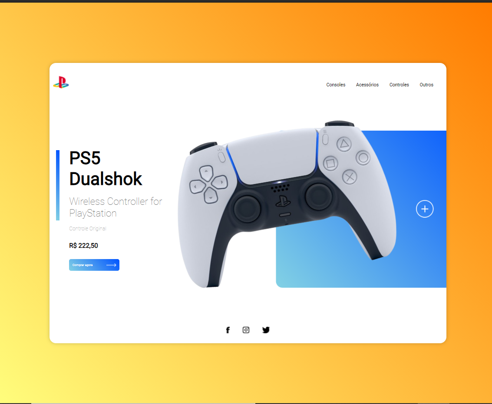
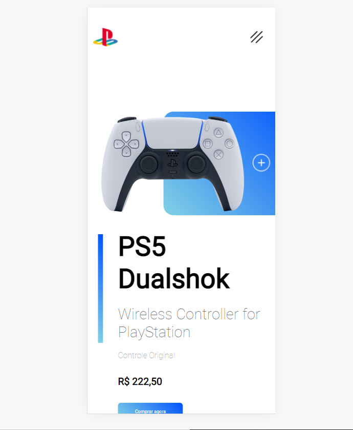

# PlayStation Store

>This project was very good to do. Its goal was mainly to integrate animation using CSS, and to develop a screen with responsiveness for all types of devices. We have above examples of this interface for PC and for Mobile.

### 🚀 Adjustments and improvements

The project has made great progress, but we can also implement new features in it, such as:

- [x] Change the Background color to Linear Gradient 45 degrees
- [ ] Add animation on button click
- [ ] Add animation on Social Media links
- [ ] Add animation to logo

### 💻 Technologies used
In this project, parameters were used based on examples on the internet. HTML, CSS and JavaScript were used, namely:  
<code></code><b>36,5%</b>  
<code></code><b>37,7%</b>  
<code></code> <b>28,8%</b>

### 🤝 Contributors

We thank the following people who contributed to this project:

<table>
  <tr>
    <td align="center">
      <a href="https://github.com/Guartieri" target="_blank">
         
        
          <b>Vinícius Guartieri</b>
        
      </a>
    </td>
  </tr>
</table>

### 💬 Contact us
 For suggestions or questions, contact us through:
 

  
  
    